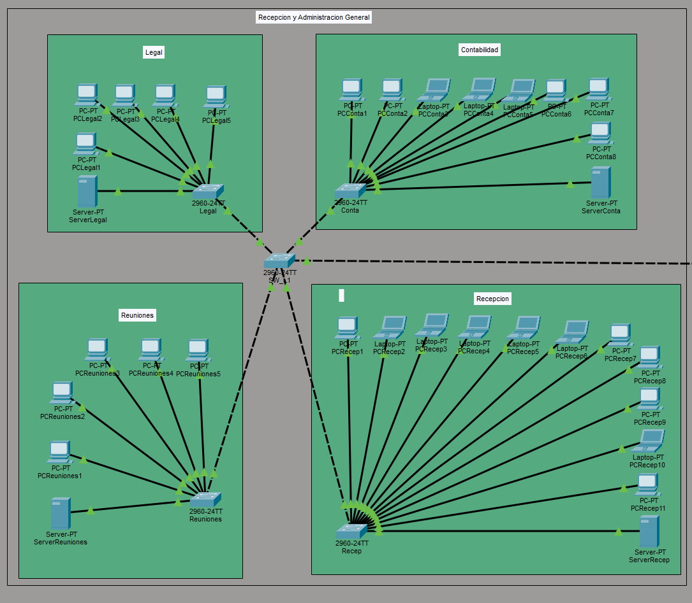
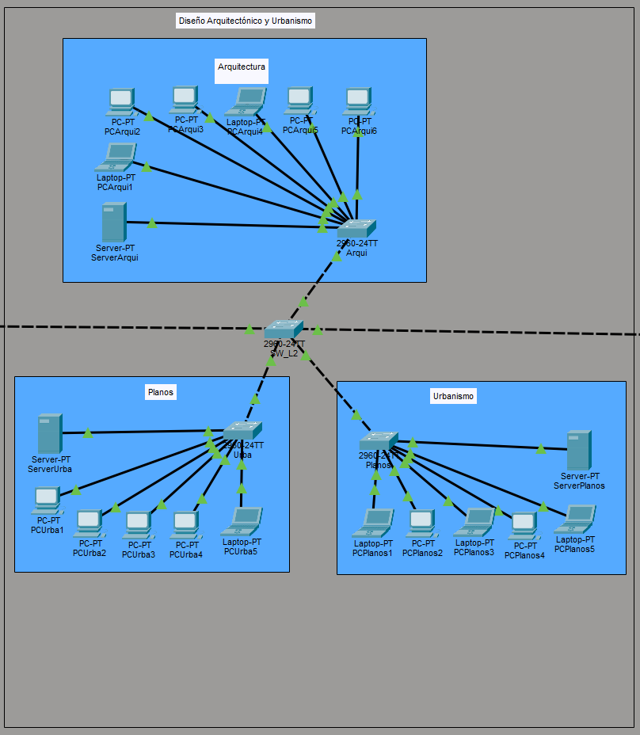
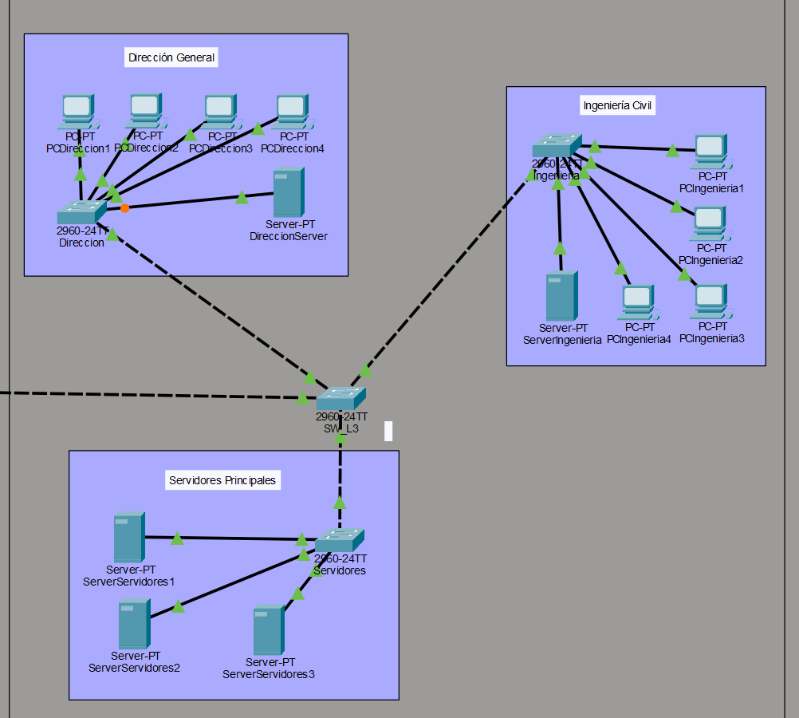
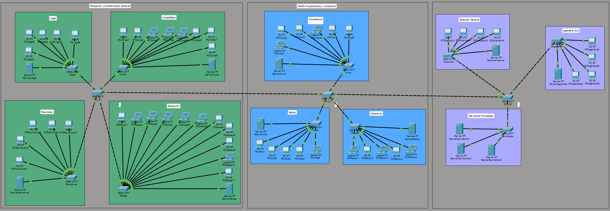
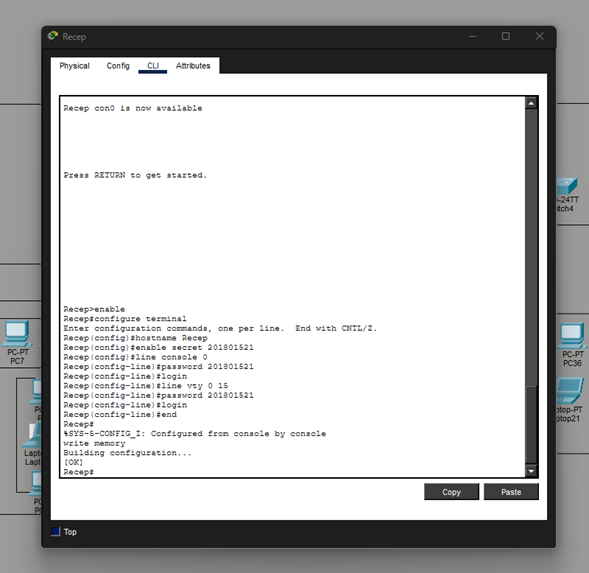
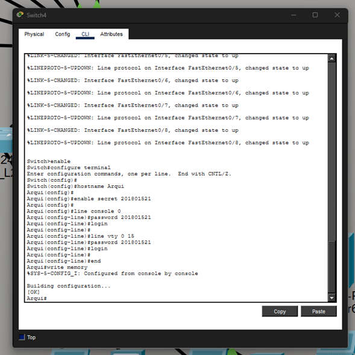
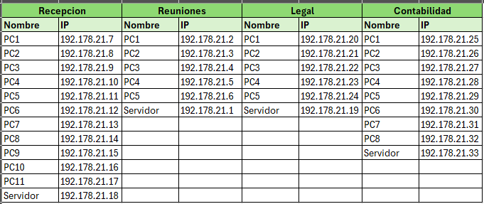
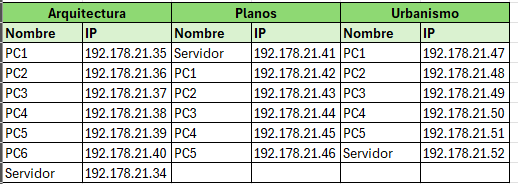
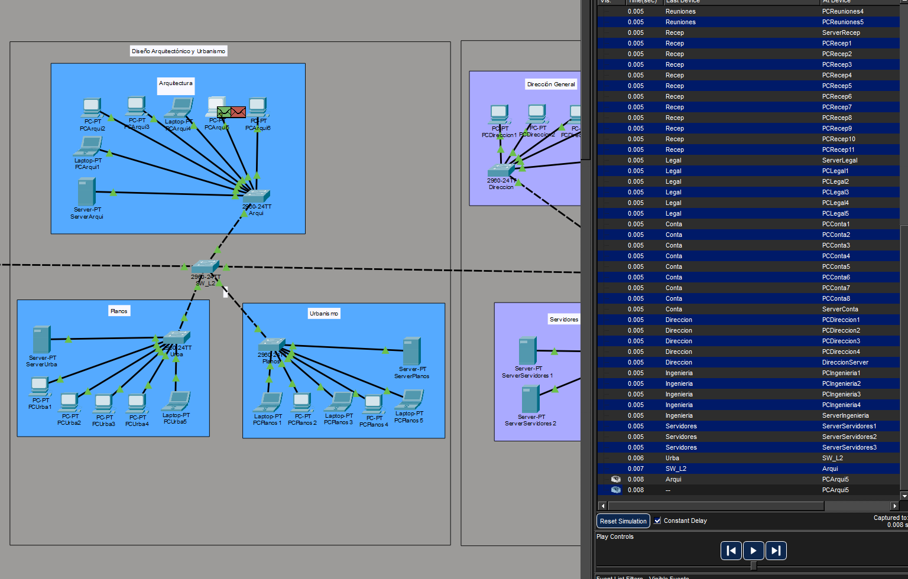

##**Manual Técnico**

Diseño e Implementación de una Red LAN en Cisco Packet Tracer
Empresa Constructiva S.A.

**Introducción**

En el presente manual técnico se describe el proceso de diseño, configuración e implementación de una red de área local (LAN) utilizando el simulador Cisco Packet Tracer. Se aplica el uso de direccionamiento IP, cableado estructurado y configuración de dispositivos de capa 2, con el propósito de construir una infraestructura de red funcional, organizada y operativa.

Se utiliza un caso práctico basado en la empresa Constructiva S.A., la cual requiere una red corporativa que permita la interconexión eficiente entre sus departamentos, computadoras y servidores distribuidos en un edificio de tres niveles.

**Objetivo**

Se implementa una red LAN funcional en el simulador Cisco Packet Tracer, aplicando los principios de direccionamiento IP, segmentación de red y configuración de switches de capa 2, con el fin de permitir la comunicación entre todos los dispositivos de la organización.

**Distribución de dispositivos**

La empresa cuenta con los siguientes dispositivos:

37 computadoras de escritorio

17 laptops

6 servidores

Estos dispositivos se distribuyen estratégicamente en los tres niveles del edificio.

*Piso 1 – Recepción y Administración General*

En el primer nivel se implementan los siguientes departamentos y dispositivos:

Se utiliza un switch principal denominado SW_L1, el cual distribuye la conexión a los switches de cada departamento.

Departamentos:

Departamento de Recepción

Se implementa 1 switch denominado Recep

Se conectan 11 computadoras

Se conecta 1 servidor

Departamento de Contabilidad

Se implementa 1 switch denominado Conta

Se conectan 8 computadoras

Departamento Legal

Se implementa 1 switch denominado Legal

Se conectan 5 computadoras

Sala de reuniones

Se implementa 1 switch denominado Reuniones

Se conectan 5 computadoras

Total piso 1: 29 computadoras y 1 servidor

*Piso 2 – Diseño Arquitectónico y Urbanismo*

Se implementa un switch principal denominado SW_L2.

Departamentos:

Departamento de Arquitectura

Se utiliza 1 switch denominado Arqui

Se conectan 6 computadoras

Departamento de Urbanismo

Se utiliza 1 switch denominado Urba

Se conectan 5 computadoras

Se conecta 1 servidor

Sala de revisión de planos

Se utiliza 1 switch denominado Planos

Se conectan 5 computadoras

Total piso 2: 16 computadoras y 1 servidor

*Piso 3 – Ingeniería y Dirección de Proyectos*

Se implementa un switch principal denominado SW_L3.

Departamentos:

Departamento de Dirección General

Se utiliza 1 switch denominado Direccion

Se conectan 4 computadoras

Departamento de Ingeniería Civil

Se utiliza 1 switch denominado Ingenieria

Se conectan 5 computadoras

Se conecta 1 servidor

Departamento de servidores principales

Se utiliza 1 switch denominado Servidores

Se conectan 3 servidores

Total piso 3: 9 computadoras y 4 servidores

**Organización de la red**

Se organiza la red utilizando una topología jerárquica.

En cada nivel se implementa un switch principal que distribuye la conexión hacia los switches de los departamentos.

Se utilizan las herramientas gráficas de Cisco Packet Tracer, tales como:

Cuadros

Líneas

Etiquetas

para representar visualmente un diagrama esquemático de cada piso del edificio:

Cada dispositivo es identificado claramente mediante un nombre que indica su departamento correspondiente.

Esto permite una mejor comprensión de la estructura de la red y facilita su administración.

**Configuración de switches**

Se configura cada switch utilizando la interfaz de línea de comandos (CLI).

Se implementan las siguientes configuraciones:

*Configuración del hostname*

Se asigna un nombre único a cada switch utilizando el comando:

hostname NOMBRE_DEL_SWITCH
Ejemplo:

hostname SW_L1
hostname Recep
hostname Conta

*Configuración de contraseña*
Se configura una contraseña de acceso utilizando el número de carnet del estudiante mediante el comando:

enable secret NUMERO_CARNET
También se configura la contraseña de consola:

line console 0
password NUMERO_CARNET
login
Y la contraseña de acceso remoto:

line vty 0 15
password NUMERO_CARNET
login

*Guardado de configuración*
Se guarda la configuración utilizando el comando:

write memory

Esto permite que la configuración se mantenga después de reiniciar el dispositivo.

**Asignación de direcciones IP**

Se utiliza la red base:

192.178.XX.0 /24
Donde XX corresponde a los últimos dos dígitos del carnet del estudiante.

Carnet: 201801521
Red base: 192.178.21.0 /24
Se asigna una dirección IP única a cada dispositivo dentro del rango:

La siguiente tabla muestra las IP asigandas:

*Piso 1*

*Piso 2*

*Piso 3*

*Verificación de conectividad*

Se verifica el correcto funcionamiento de la red mediante:

Pruebas de ping
Se utiliza el comando:

ping DIRECCION_IP
Esto permite comprobar la comunicación entre dispositivos.

Ejemplos:

*Modo simulación*

Se utiliza el modo simulación de Cisco Packet Tracer para analizar los protocolos ARP y ICMP.

Se verifica que los paquetes sean transmitidos correctamente entre los dispositivos:

**Resultado esperado**

Al finalizar la implementación, se obtiene una red LAN completamente funcional que permite:

Comunicación entre todos los departamentos

Comunicación entre computadoras y servidores

Correcta asignación de direcciones IP

Correcta configuración de switches

Organización clara de la topología de red

**Conclusión**

Se implementa exitosamente una red LAN corporativa utilizando Cisco Packet Tracer, aplicando los principios de direccionamiento IP, configuración de switches y organización de red jerárquica.

Se garantiza la conectividad entre todos los dispositivos mediante pruebas de comunicación y simulación de protocolos de red.

La infraestructura implementada permite una red organizada, escalable y funcional, cumpliendo con los requerimientos establecidos para la empresa Constructiva S.A.